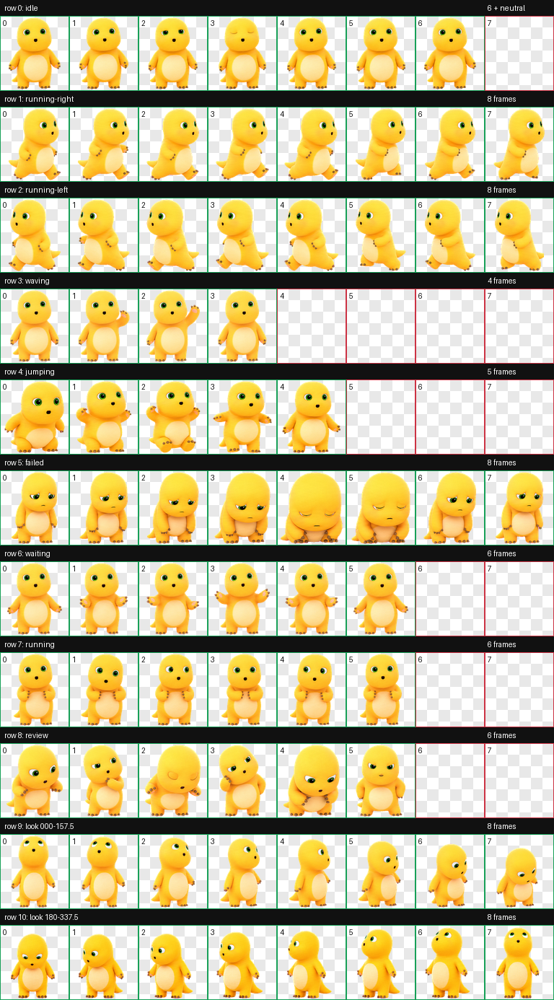

# Codex 奶龙桌宠（非官方）

一个可直接安装到 Codex 桌面版的奶龙动态宠物包。图像由 AI 辅助生成，并按 Codex 自定义桌宠 v2 图集格式完成透明背景、动作与方向测试。

> 这是非官方、粉丝创作的第三方角色衍生包，与奶龙官方及 OpenAI 均无隶属、授权或背书关系。使用前请阅读 [NOTICE.md](NOTICE.md)。

## 可选版本

- **第一版 · 圆滚滚奶龙**：当前仓库根目录，宠物 ID 为 `nailoong`。
- **第二版 · 抽象奶龙**：见 [`v2-abstract/`](v2-abstract/)，宠物 ID 为 `nailoong-abstract`；可与第一版同时安装。

## 下载

- 在仓库右侧打开 **Releases**，下载对应版本的 ZIP 安装包。
- 只想安装第二版时，也可以直接进入 [`v2-abstract/`](v2-abstract/) 下载 `pet.json` 与 `spritesheet.webp`。

## 功能

- Codex 自定义桌宠 v2 图集
- 8 × 11 帧网格，1536 × 2288 WebP（RGBA）
- 9 组基础动作：待机、左右奔跑、挥手、跳跃、失败、等待、奔跑、审阅
- 16 个视线方向
- 已通过尺寸、透明通道、色键残留和动作图集验证

## 安装

1. 在 Windows 中创建目录：

       %USERPROFILE%\.codex\pets\nailoong

2. 将下面两个文件复制到该目录：

       pet.json
       spritesheet.webp

3. 编辑 %USERPROFILE%\.codex\config.toml。在已有的 [desktop] 段中设置：

       [desktop]
       selected-avatar-id = "custom:nailoong"

   如果文件中已经有 [desktop]，只添加或替换 selected-avatar-id，不要重复创建该段。

4. 重新打开桌宠；若未立即生效，重启 Codex 桌面版。

## 文件

| 文件 | 说明 |
| --- | --- |
| pet.json | Codex 桌宠元数据 |
| spritesheet.webp | 可直接安装的 v2 动画图集 |
| preview-idle.gif | 待机动画预览 |
| contact-sheet.png | 全部帧的联系表 |
| look-directions.png | 16 个视线方向预览 |
| validation.json | 可公开复核的验证摘要 |
| NOTICE.md | 第三方角色和商标权利声明 |
| LICENSE-CODE | 仅适用于原创配置与文档的许可 |

## 验证摘要

- 图集格式：WEBP / RGBA
- 尺寸：1536 × 2288
- 网格：8 列 × 11 行
- spriteVersionNumber：2
- 透明像素 RGB 残留：0
- 不透明色键像素：0
- 色键边缘像素：0
- 最终结果：通过，无图集格式警告

详细机器可读结果见 [validation.json](validation.json)。

## 权利与使用

本仓库公开提供安装配置和生成素材，方便个人体验、学习和交流；这不代表对奶龙角色素材授予开源许可。奶龙角色、名称、形象和相关商标的权利归各自合法权利人所有。请勿将本包用于误导性宣传、冒充官方或未经授权的商业用途。

本仓库原创的配置说明与文档按 [LICENSE-CODE](LICENSE-CODE) 提供；该许可明确不包含 spritesheet.webp、预览图及其中的第三方角色要素。

奶龙官方页面：[nailoong.com](https://www.nailoong.com/ipStar/Nailong/)

---

English: An unofficial, AI-assisted Nailoong pet package for the Codex desktop app. Third-party character and trademark rights are excluded from the code/documentation license; see [NOTICE.md](NOTICE.md).