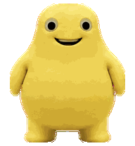

# 第二版：抽象奶龙

这一版采用更抽象、略带低成本早期 3D 吉祥物质感的黄色团子形象：大肚子、外凸圆眼、固定笑容、软塌手脚。它是独立宠物包，不会覆盖第一版。

## 安装

1. 创建目录：

       %USERPROFILE%\.codex\pets\nailoong-abstract

2. 将本目录中的两个文件复制进去：

       pet.json
       spritesheet.webp

3. 编辑 `%USERPROFILE%\.codex\config.toml`，在已有的 `[desktop]` 段中设置：

       [desktop]
       selected-avatar-id = "custom:nailoong-abstract"

4. 若未立即生效，重启 Codex 桌面版。

切回第一版时，将值改为 `custom:nailoong` 即可。

## 文件

| 文件 | 说明 |
| --- | --- |
| `pet.json` | 第二版宠物元数据 |
| `spritesheet.webp` | 可直接安装的 8 × 11、RGBA v2 图集 |
| `preview-idle.gif` | 待机动画预览 |
| `contact-sheet.png` | 全部动作与视线帧总览 |
| `look-directions.png` | 16 向视线专项预览 |
| `validation.json` | 最终机器验证结果 |
| `direction-blind-validation.json` | 三轮独立方向盲测汇总 |
| `direction-semantics.json` | 16 个视线方向的语义复核 |
| `look-continuity.json` | 相邻视线帧的连续性测量 |

图集机器校验结果：1536 × 2288、WebP/RGBA、8 × 11、`spriteVersionNumber = 2`，无格式错误或警告；14 组方向盲测全部通过。

## 说明

这是非官方、粉丝创作的 AI 辅助衍生包。第三方角色、名称、形象和商标权利不包含在仓库的代码/文档许可中；详见仓库根目录的 [`NOTICE.md`](../NOTICE.md) 与 [`LICENSE-CODE`](../LICENSE-CODE)。