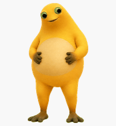

# 第四版 · 奶蛙·舞台摇摆版

一只故意古早、黄橙色、长腿的低清 3D 奶蛙桌宠。它的核心动作是交叉步、侧胯、摊手停顿和高抬膝；眼睛会鼓起、斜看、眨眼、上翻或猛地低头，整体是夸张的舞台喜剧感。

## 安装

1. 在 Windows 中创建目录：

       %USERPROFILE%\.codex\pets\milk-frog-showtime

2. 将本目录中的两个文件复制进去：

       pet.json
       spritesheet.webp

3. 编辑 `%USERPROFILE%\.codex\config.toml`，在已有的 `[desktop]` 段中设置：

       [desktop]
       selected-avatar-id = "custom:milk-frog-showtime"

   如果已有 `[desktop]`，只替换 `selected-avatar-id`，不要重复创建该段。

4. 重新打开桌宠；若没有立即生效，重启 Codex 桌面版。

## 文件

| 文件 | 说明 |
| --- | --- |
| `pet.json` | 奶蛙的 Codex 桌宠元数据 |
| `spritesheet.webp` | 可直接安装的 8 × 11、RGBA v2 图集 |
| `preview-idle.gif` | 去色后的白底待机动画预览 |
| `contact-sheet.png` | 全部动作与视线帧联系表 |
| `look-directions.png` | 16 向视线专用预览 |
| `validation.json` | 图集尺寸、格式、透明通道验证 |
| `direction-blind-validation.json` | 三轮独立方向盲测汇总 |
| `direction-semantics.json` | 16 个方向的语义复核 |
| `look-continuity.json` | 相邻视线帧连续性测量 |

## 验证摘要

- WebP / RGBA，1536 × 2288，8 列 × 11 行
- `spriteVersionNumber = 2`
- 图集验证通过：无尺寸、格式、透明通道或精灵布局错误
- 三轮独立方向盲测通过；上、下、左、右与斜向均可识别
- 预览 GIF 由最终去色图集白底渲染，避免透明 GIF 在部分查看器中出现粉边

## 说明

这是非官方、粉丝创作的 AI 辅助衍生包，不代表任何角色权利人或 OpenAI 的授权、隶属或背书。角色、名称、形象和商标权利归各自合法权利人所有；请勿用于误导性宣传、冒充官方或未经授权的商业用途。仓库中的原创配置和文档许可请见根目录的 [LICENSE-CODE](../LICENSE-CODE) 与 [NOTICE.md](../NOTICE.md)。
